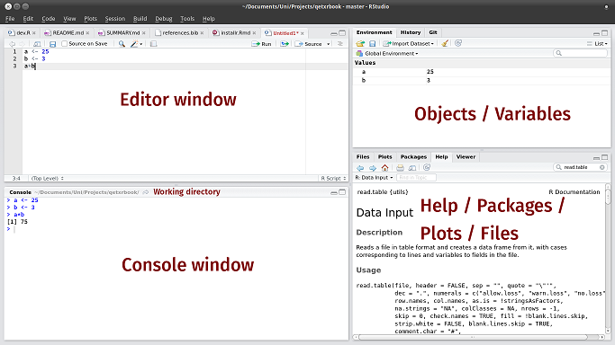
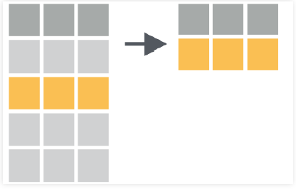
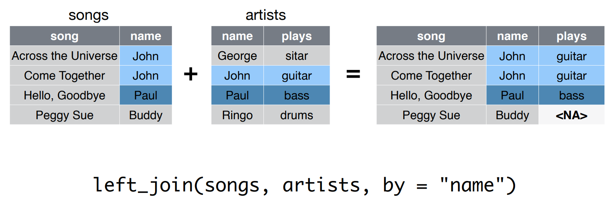
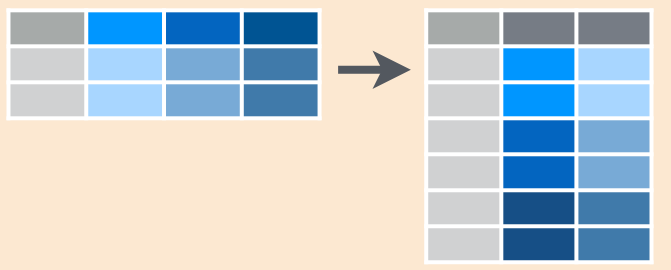

```{r setup, include=FALSE}
knitr::opts_chunk$set(fig.path = "static/img/", echo = TRUE, cache = TRUE)
source("setup.R")
```

# <br><br>Curso de R<br><small> <br><br> MiDaS</small>{ .center .white data-background="#75AADB" }

# Introduccion a R{ .center .white data-background="#75AADB" }

## Descarga e Instalación

- R, el software computacional, se descarga desde el [CRAN](http://cran.r-project.org). Debes elegir la opción que corresponda con tu sistema operativo.
- Rstudio, el panel de control, se descarga desde [Rstudio](http://www.rstudio.com). Elegir la primera opción, "RStudio Desktop Open Source License". 
- Instalar ambos programas de la forma usual.
- Además existe una versión online, [Rstudio Cloud](http://rstudio.cloud)

## Interfaz básica de RStudio



## Primeras Interacciones con R{ .center .white data-background="#75AADB" }

## R como calculadora aritmética

En R se pueden realizar todas las operaciones aritméticas:
  
```{r}
sqrt(2^4 + exp(3)/55 - log(5*8-2)) 
```

**Nota:** Para correr código desde el editor, utilizar *ctrl + enter*.

## R como calculadora lógica

Además, se pueden realizar operaciones lógicas(&,\|), las cuales retornan como resultado TRUE o FALSE:
  
```{r}
38 >= 15
3 < 5 & 6 < 5
3 < 5 | 6 < 5 
```

## Objetos básicos de R

En R podemos guardar objetos utilizando las asignación '\<-' o, en su defecto, '='.

```{r}
a <- 20 # Valor numérico
b = 3^2
c <- "Hola Mundo" # String o carácter.
```

Para visualizar un objeto en consola, basta con escribir su nombre en ella, o bien ejecutar la línea deseada desde el editor.

```{r}
a + b
```

## Objetos básicos de R: Vectores

Para crear un vector se ocupa la función **c()**. Además podemos crear secuencias con la función **seq()**.
```{r}
x <- c(5,b,7,8,-8,20,7,a)
x
y <- seq(1,10)
y
```

## Objetos básicos de R: Vectores

Podemos acceder a un elemento de un vector en una posición específica de un vector utilizando '[]'. Algunos ejemplos:

```{r}
x[3] # Elemento en la posición 3
x[2:4] # Elementos en las posiciones 2 y 4 inclusive
``` 

## Objetos básicos de R: Vectores

```{r}
x[c(5,8)] # Elementos en la posición 5 y 8 
x[-4] # Vector original sin el elemento en la posición 4
```

## Objetos básicos de R: Funciones

La principal herramienta para trabajar con los diferentes objetos en R son las funciones. Algunos ejemplos son:
  
- `sum()`
- `mean()`
- `which()`
- `summary()`

----

**Importante:** Si deseas saber como utilizar una función en específico puedes hacer `?nombre_funcion()`. También puedes buscar [aquí](https://www.google.com).

```{r}
mean(x)
summary(y)
```


## Objetos básicos de R: Paquetes

Los paquetes de R son el eje central de su funcionamiento. En cada uno de ellos existen funciones desarrolladas para resolver diferentes tipos de problemáticas. En esta ocasión instalaremos y cargaremos el paquete 'Tidyverse':
  

## Objetos básicos de R: Paquetes

Para utilizar un paquete en R hay que realizar las siguientes operaciones:
  
- Instalar el paquete, **install.packages('nombre_paquete').** 
- Cargar el paquete,  **library('nombre_paquete')**.

```{r, message = FALSE}
# install.packages('tidyverse')
library(tidyverse)
```

## Objetos básicos de R: `tibbles`

Corresponden a una forma de guardar bases de datos en `R`. 

```{r}
data <- tibble("Sexo" = c("H","M","H","M"), "Edad" = c(20,18,19,30))
data
```

## Objetos básicos de R: `tibbles`

Puedes acceder a los elementos de un `tibble` utilizando `[,]`

```{r}
data[1,2]
data[1,]
```

## Objetos básicos de R: `tibbles`

```{r}
data[,2]
```

- Además, se puede acceder a una columna específica de la BD utilizando su nombre 

```{r}
data$Sexo
```

## Operador %>% 

Permite realizar composición de funciones. Un ejemplo de su utilización es:
  
```{r}
x %>% mean() %>% log()
log(mean(x))
```

## Actividad 1

- Genere un vector con los primeros 1000 números impares.
- Del vector anterior, obtenga los impares número 1, 10, 100 y 1000.
- Cálcule la suma de la raíz de los números generados antes utilizando 2 métodos diferentes.

# Manejo de Base de Datos{ .center .white data-background="#75AADB" }

## Orígen de la BD

Los datos pueden provenir de muchas fuentes:
  
- Archivos de texto(txt ó csv)
- Excel(xlsx)
- SPSS(sav)
- SQL(sql)
- STATA(dta)
- Una página web.
- etc.

## Funciones para Importar

Cada fuente tiene su función de importación en tidyverse.

- Si es csv: **read_csv**.
- Si es texto: **read_delim**.
- Si es excel: **read_excel**.
- Si es spss: **read_sav**.

Para más información, pueden entrar al siguiente [torpedo](https://resources.rstudio.com/spanish-pdfs/data-import-cheatsheet-spanish).

## Ejemplo: storms.csv

La base de datos storms se encuentra en el siguiente [link](https://raw.githubusercontent.com/rstudio/EDAWR/master/data-raw/storms.csv).

```{r}
url  <- 'https://raw.githubusercontent.com/rstudio/EDAWR/master/data-raw/storms.csv'
download.file(url, "storms.csv", mode = "wb")

library(readr)
storms <- read.csv('storms.csv', header = T)
storms
```

## Ejemplo: storms.csv

El comando **glimpse()** nos otorga características de las columnas(variables) de la BD.
```{r}
glimpse(storms)
```

## Ejemplo: numeros.xlsx

```{r}
library(readxl)
numeros <- read_excel('Datasets/numeros.xlsx')
numeros
```

## Ejemplo: submuestra.dta

```{r}
library(haven)
submuestra <- read_dta("Datasets/submuestra ENE 2018 07 JJA.dta")
head(submuestra)
```


## filter(): *Seleccionar filas*

Permite seleccionar filas de cierta BD utilizando un criterio particular.



## filter(): *Código*

```{r}
filter(storms, storm %in% c("Alberto", "Ana"))

storms %>%
  filter(storm %in% c("Alberto", "Ana"))
```

## select(): *Seleccionar Columnas*

Permite seleccionar columnas de una base de datos en específico.


## select() : *Código*

```{r}
select(storms, storm, pressure)
storms %>%
  select(storm, pressure)
```

## select(): *Código alternativo*

```{r}
storms %>%
  select(-wind, -date)

```

## arrange(): *Ordenar filas*

Permite ordenar de menor a mayor una BD teniendo en consideración una o más variables.


## arrange(): *Código*

```{r}
arrange(storms, wind)
storms %>%
  arrange(wind)
```

## arrange(): *Código de mayor a menor*

```{r}
storms %>%
  arrange(desc(wind))
```

## mutate(): *Crear/Modificar Columnas*

Permite crear o modificar una columna de la BD.


## mutate(): *Código*

```{r}
storms %>%
  mutate(ratio = pressure/wind, inverse = 1/ratio)
```

## summarise(): *Resumir Columnas*

Permite aplicar funciones de resumen en las columnas de una BD.


## summarise(): *Código*
```{r}
storms %>% 
  summarise(promedio = mean(wind), desviacion_standard = sd(wind))
```

## group_by + summarise: *Resumir Columnas por Grupos*

Group_by divide la base de datos en grupos, lo cual permite obtener medidas de resumen por grupos utilizando summarise.


## group_by + summarise: *Código*

```{r, cache = FALSE}
pollution <- read.csv("https://raw.githubusercontent.com/rstudio/EDAWR/master/data-raw/pollution.csv")
```

```{r}
pollution %>%
  group_by(city) %>%
  summarise(promedio = mean(amount),
            suma = sum(amount),
            n = n(),
            max = max(amount))
```

## mutate + case_when: *Creación de indicadores*

**case_when()** es una función que permite, en conjunto con **mutate()**, generar variables indicadoras.

```{r}
pollution %>% 
  mutate(mayor_30 = case_when(
    amount > 30 ~ 1,
    TRUE ~ 0)) -> pollution2
pollution2
```

----

Se pueden crear variables con más de 2 valores:
  
```{r}
pollution2 %>% 
  mutate(categorias = case_when(
    amount >= 14 & amount < 24 ~ '[14,23]',
    amount >= 24 & amount < 57 ~ '[24,56]',
    TRUE ~ '>56'
  )) -> pollution2
pollution2
```


## Importar datos

```{r, message = FALSE}
songs <- read_csv("Datasets/songs.csv")
songs
```

----
  
```{r}
artists <- read_csv("Datasets/artists.csv")
artists
```

## Rename: *Renombrar columnas*

Permite cambiar los nombres de las columnas seleccionadas

```{r}
artists %>%
  rename(Nombres = name) -> artist2
artist2
```

## join: *Juntar bases de datos*

Existen 7 funciones, en dplyr, que permiten juntar/contrastar dos bases de datos en una sola, utilizando una columna como link. Algunos ejemplos son:
  
  - **inner_join()**
  - **left_join()**
  - **right_join()**
  
## **left_join**: *Ejemplo*
  
  

## Algunos otros ejemplos:

```{r}
artist3 <- inner_join(songs, artists, by = "name")
artist3
artist4 <- right_join(songs, artists, by = "name")
artist4
```
----
  
¿Qué pasa si las columnas links poseen 2 nombres diferentes?
  
```{r}
left_join(songs,artist2, by = c("name" = "Nombres"))
```

## gather: *Reunir columnas*

Coloca nombres de columnas en una variable (columna) __key__, recolectando los 
valores (__value__) de las columnas en un __sola__ columna



## gather: *Código*

```{r}
table4ag <- gather(table4a, `1999`, `2000`, key = "year", value = "cases")
table4ag
```

## spread: *Esparcir*

Esparce un par de columnas (2, key-value) en multiples columnas 


## spread: *Código*

```{r}
table2s <- spread(table2, type, count)
table2s
```

## Actividad 2

- Cargue la base de datos Encuesta.xlsx.
- Seleccione Región, Sexo, Edad, cuánto gastó en seguridad y Score Socioeconómico. Filtre según hombres de Valparaíso.
- Ordene de menor a mayor la edad. Genere un indicador para la variable edad.
- Añada una nueva variable denominada PRSC, calculada como el Score del individuo dividido por el máximo del score observado.
- Obtenga el promedio del PRSC para cada grupo de gasto en seguridad.

**Nota:** Cada ítem se realiza utilizando la base de datos resultante del ítem anterior

# Analisis exploratorio y visualizacion de datos { .center .white data-background="#75AADB"}

## Definición técnica
  
Representación gráfica de datos __codificando la información__ como: posición, tamaño, formas, colores


  
## Algunos gráficos
  
  
  
## Visualizando con ggplot2

Características:
  
- Paquete para visualizar datos mediante capas
- Es muy poderoso y flexible
- Se carga junto al `tidyverse`
- No es la única opción en R para graficar

## Datos

```{r, echo = FALSE}
theme_set(theme_gray())
```

```{r, echo=TRUE}
library(gapminder)
data(gapminder)
paises <- gapminder %>% 
  filter(year == max(year))
paises
```

## Creando un gráfico

```{r, echo=TRUE,  fig.height = 4}
ggplot(data = paises)
```

## Mejorando un gráfico

```{r, echo=TRUE,  fig.height = 4}
ggplot(data = paises) + 
  geom_point(mapping = aes(x = lifeExp, y = gdpPercap))
```

## Que sucedió?

```r
ggplot(data = paises) + 
  geom_point(mapping = aes(x = lifeExp, y = gdpPercap))
```
  
- `ggplot()` crea un sistema de coordenadas al cual se pueden agregar capas
- `ggplot(data = paises)` da un grafico vacío pues no agregamos capas
- `geom_point()` agrega una capa de puntos al gráfico usando las filas de `paises`

----

- Cada función `geom_algo` tiene un argumento de mapping que define cómo se asignan o se “mapean” las variables del conjunto de datos a propiedades visuales del `geom_algo`
-  El argumento de mapping siempre aparece emparejado con `aes()`, y los argumentos `x` e `y` especifican qué variables asignar a los ejes `x` e `y`
- Para más gráficos, pueden visitar el siguiente [link](http://www.sthda.com/english/wiki/be-awesome-in-ggplot2-a-practical-guide-to-be-highly-effective-r-software-and-data-visualization)

----
  
Podemos setear las propiedades estéticas de tu geom manualmente:
  
```{r, echo=TRUE,  fig.height = 4}
ggplot(data = paises) + 
  geom_point(mapping = aes(x = lifeExp, y = gdpPercap), color = "blue")
```

---- 
  
  En este caso un punto no solo puede poseer x e y, puede tener tamaño dado
por una variable

```{r, echo=TRUE,  fig.height = 4}
ggplot(data = paises) + 
  geom_point(mapping = aes(x = lifeExp, y = gdpPercap, size = pop), color = "blue")
```

---- 
  
Quizás en lugar de setear color fijo, podemos asignarlo segun una variable

```{r, echo=TRUE,  fig.height = 4}
ggplot(data = paises) + 
  geom_point(mapping = aes(x = lifeExp, y = gdpPercap, size = pop, color = continent))
```

---- 
  
O realizar _facets_/paneles

```{r, echo=TRUE,  fig.height = 4}
ggplot(data = paises) + 
  geom_point(mapping = aes(x = lifeExp, y = gdpPercap, size = pop)) +
  facet_wrap(vars(continent))
```

## Paquete Útil: `GGTHEMEASSIST`

Para editar algunas características de los gráficos, se puede utilizar el adicional proveniente del paquete `ggThemeAssist`. Para ello:

- Instalar el paquete.
- Seleccionar el código **completo** que genera el gráfico.
- Hacer click en Addins > ggplot Theme Assistant.
- Editar todo lo deseado.

## Gráficos en la misma ventana: `Rmisc`

Generamos 3 gráficos diferentes:

```{r, echo=TRUE,  fig.height = 4}
Ang <- gapminder %>% 
  filter(country == 'Angola')

p1<- ggplot(data = Ang) + 
  geom_line(mapping = aes(x = year, y = gdpPercap))+
  ggtitle("gdpPercap")
p2<- ggplot(data = Ang) + 
  geom_line(mapping = aes(x = year, y = lifeExp))+
  ggtitle("lifeExp")
p3<- ggplot(data = Ang) + 
  geom_line(mapping = aes(x = year, y = pop))+
  ggtitle("pop")
```

----

```{r}
library(Rmisc)
multiplot(p1, p2, p3, cols=1)

```

----

Ahora poniéndolo todo junto:
  
```{r, echo=TRUE,  fig.height = 4}

ggplot(data = Ang) + 
  geom_line(mapping = aes(x = year, y = scale(gdpPercap),colour = "gdpPercap"))+
  geom_line(mapping = aes(x = year, y = scale(lifeExp),colour = "lifeExp"))+
  geom_line(mapping = aes(x = year, y = scale(pop),colour = "pop"))+
  ylab('')

```

## Actividad III

Abra el archivo `Actividad-3.pdf` y responda las preguntas en él.

# Programación en R { .center .white data-background="#75AADB" }

## Desarrollo de funciones
La declaración de una función se realiza de forma general como sigue:
`function(<lista de argumentos>) <cuerpo de la función>`<br>

- `<lista de argumentos>` es una lista de normbres de los argumentos.
- `<cuerpo de la función>` representa el contenido del código a ejecutar cuando se llama a la función.

Ejemplo:
```{r}
function(name) cat("Hello",name,"!")
```

---

<p style='text-align: justify;'> 
Para R, una función es un objeto específico.<br><br>
Por lo tanto, crear una función corresponde a asignar el objeto "función R"
a una variable, cuyo nombre corresponde a la función misma.<br><br>
Por ejemplo, para crear la función `hello()`, se puede proceder como sigue:
</p>

```{r}
hello <- function(name) cat("Hello",name,"!")
hello
```
---

<p style='text-align: justify;'> 
Para que esta función se ejecute, el usuario debe escribir el nombre de la función,
seguido por el argumento entre paréntesis.
</p>
```{r}
hello("Peter")
hello("Fernanda")
```
---

### Cuerpo de la función

- El cuerpo de una función puede ser una simple instrucción de R o una secuencia de
instrucciones de R.
- En este último caso, las instrucciones deben estar incluidas entre
los caracteres **{** y **}** para delimitar el principio y el final del cuerpo de la
función.
- Se pueden escribir varias instrucciones de R en la misma línea siempre que
están separados por el caracter **;**.
- Cuando el cuerpo de la función incluye varias instrucciones de R escritas
en la misma línea, no olvidar escribirlos entre los caracteres **{**
y **}**.

---

Recuerde que en una línea, cualquier código escrito después del carácter # no es
interpretado por R y se toma como un comentario

```{r}
hello <- function(name) {
 # Convert the name to upper case.
 name <- toupper(name)
 cat("Hello",name,"!")
 }
hello("Peter")
```

---

### Argumentos

- Al declarar una función, todos los argumentos se identifican con un nombre único.
- Cada argumento puede asociarse con un valor predeterminado.
- Para especificar un valor predeterminado, se usa el carácter = seguido del valor predeterminado.
- Cuando se llama a la función sin un argumento, se utilizará el valor predeterminado.

Ejemplo:

```{r}
hello <- function(name="Peter") cat("Hello",name,"!")
hello()
```

---

Agreguemos a nuestra función `hello()` la posibilidad de elegir un idioma, y veamos algunas llamadas de esta función

```{r}
hello <- function(name="Peter",language="eng") {
 cat(switch(language,fr="Bonjour",sp="Hola",eng="Hello"),name,"!")
 }
hello()
hello(name="Ben")
hello(language="fr")
```
---

En el mismo contexto, una segunda funcionalidad de R es que permite llamar a una función sin escribir el nombre completo de un argumento.
```{r}
hello(lang="eng");hello(l="eng")
hello(l="e")
hello("Ben","fr")
```

---

- Se puede asignar una lista de argumentos complementarios con la sintaxis ...
- Al llamar a la función, todos los argumentos "nombrados" que no están en la lista de argumentos se agrupan en la estructura ...
- En el cuerpo de la función, el usuario puede usar la sintaxis ... como si copiara-pegara la lista de argumentos suplementarios.

```{r}
test.3points <- function(a="foo",...) print(list(a=a,...))
test.3points("bar",b="foo")
```

---

La función `hello()` no devuelve ningún objeto.

```{r}
res <- hello()
res
```

---

- Una regla general para devolver un objeto es usar la función `return()`.
- Esta instrucción detiene la ejecución del código del cuerpo de la función y devuelve el objeto entre paréntesis.

```{r}
hello <- function(name="Peter") {
 return(paste("Hello",name,"!",collapse=" "))}
hello()
message <- hello()
message
```

---

- La noción de alcance de una variable es muy importante para un lenguaje que permite desarrollar funciones.<br><br>
- La idea principal es que las variables definidas dentro del cuerpo de una función tienen un alcance local durante la ejecución de la función.<br><br>
- Esto significa que una variable dentro del cuerpo de una función es físicamente diferente de otra variable con el mismo nombre, pero definida en el espacio de trabajo de su sesión R.<br><br>
- En términos generales, el alcance local significa que una variable solo existe dentro del cuerpo de la función.<br><br>
- Después de la ejecución de la función, la variable se elimina automáticamente de la memoria de la computadora.

---

```{r}
message <- "hello Pierre !"
message # Workspace initialization.
hello <- function(name="Peter",message="hello") {
 print(message)
 message <- paste(message,name,"!",collapse=" ")
 print(message)
 invisible(message)}
hello()
message # Workspace has not been modified!
```

---

```{r}
message <- hello()
message # Workspace has been modified!
message <- hello(message="Welcome")
message # Workspace has been modified again!
```


## Debugging de funciones

- Una función de depuración útil en R es la función `browser()`.
- Si inserta la instrucción `browser()` en el cuerpo de su función, el programa se detendrá en el lugar donde se insertó.
- Al escribir la letra n (para el siguiente), se puede inspeccionar el código y el contenido de las variables secuencialmente.
- Para salir del modo de inspección, se debe escribir Q.

---

```{r}
x <- matrix(rnorm(12),nrow=2); 
apply(x,1,function(y){browser();sum(y)})
```

---

- Otra función interesante es `debug()`, que es equivalente a colocar la instruccuón `browser()` en la parte superior del cuerpo de una función.
- Por lo tanto, `debug(var)` marca la funció `var` como depurable.
- Cualquier llamada posterior de esta función iniciará el depurador.

```{r, eval = FALSE}
debug(var)
var(1:3)
```
<p style='text-align: justify;'>
Para deshacerse de esta marca, se usa la función `undebug()`.
<p/>
```{r, eval=FALSE}
undebug(var)
```

## Administración

- Después de haber creado los objetos R, puede obtener la lista de todos los objetos con la función `ls()` o la función `objects()`.
- Para eliminar objetos, se usa la función `rm()`.
- Vale la pena señalar que el comando `getwd()` devuelve el directorio de trabajo actual. El comando `setwd()` se usa para cambiar el directorio de trabajo.

---

- Cuando se trabaja con R, se crean objetos: vectores, matrices, funciones, etc.<br><br>
- Estos objetos se guardan físicamente en un archivo en el disco duro llamado espacio de trabajo.
- La extensión del nombre del archivo debe ser `.RData`.
- Es posible crear varios archivos .RData: uno para cada proyecto en el que está trabajando.
- Debe crear estos archivos `.RData` en diferentes carpetas de manera apropiada.

---

<p style='text-align: justify;'>
Por ejemplo, suponga que está trabajando en dos proyectos diferentes: uno relacionado con automóviles y otro relacionado con eventos climáticos.<br><br>
Luego, puede crear una carpeta llamada `Cars` que contenga un archivo `cars.RData`, y otra carpeta llamada `Climate` que contenga un archivo llamado `climevt.RData`; estos archivos contendrán los objetos R correspondientes a los dos estudios.<br><br>
La función `save.image()` se usa para guardar un espacio de trabajo; puede usar la función `load()` para cargar un espacio de trabajo existente.
<p/>

---
<!---
## Actividad

Inicie R y escriba las siguientes instrucciones:

```{r, eval = FALSE}
Mc <- "My car"
# Use the up arrow and change the last command to:
Yc <- "Your car"
# Save a file cars.Rhistory in the folder Cars.
savehistory("/path/to/Cars/cars.Rhistory")
q("no") # Exit R.
# Open R again.
# Note that the up arrow does not
# give access to the last two commands.
# Open the file cars.Rhistory in the folder Cars.
loadhistory(file.choose())
# Now, the up arrow can be used
# to find old commands.
q("no")
```

---
--->

<p style='text-align: justify;'>
R incluye un mecanismo para recuperar y volver a ejecutar comandos antiguos.<br><br>
Las flechas hacia arriba y hacia abajo del teclado se pueden usar para retroceder y avanzar en el historial de comandos.<br><br>
Una vez que haya localizado un comando con este método, puede mover el cursor con las flechas derecha e izquierda, eliminar caracteres con la tecla `DEL` y agregar o modificar caracteres con el teclado.<br><br>
Para guardar el historial de comandos de la sesión actual, use el comando `savehistory()`.<br><br>
Para cargar el historial de comandos de una sesión anterior, use el comando `loadhistory()`.<br><br>
Los comandos se guardan en un archivo que debe tener la extensión `.Rhistory` (o `.rhi` en versiones anteriores de R)
<p/>

# Programación eficiente en R{ .center .white data-background="#75AADB" }

## Objetivos

<p style='text-align: justify;'>
Muchas personas que usan R no se describirían a sí mismas como "programadores".<br><br>
En cambio, tienden a tener un conocimiento de nivel avanzado, comprender estructuras estándar de datos de R, como vectores y data frames, pero tienen poca capacitación formal en informática.<br><br> </p>
<p align = 'justify'> Discutiremos: </p>

- Técnicas de programación (panorama general).
- Asignación de memoria y código vectorizado.

## Prerrequisitos

<p style='text-align: justify;'>
Se utilizarán dos paquetes: `complier` y `memoise`.<br><br>
Estos paquetes forman parte de las librerias base de R, por lo tanto sólo se los debe cargar
<p/>
```{r}
library("compiler")
library("memoise")
```
<p style='text-align: justify;'>
También serán utilizados (en los ejercicios) los paquetes `pryr` y `microbenchmark`.
<p/>

## Consejos Generales

<p style='text-align: justify;'>
Los lenguajes de bajo nivel como C y Fortran exigen más del programador.<br><br>
Obligan a declarar el tipo de cada variable utilizada, dan la gran responsabilidad de la administración de memoria y se tiene que compilar.<br><br>
La ventaja de tales lenguajes, en comparación con R, es que son más rápidos de ejecutar.<br><br>
La desventaja es que se tardan más en aprender y no se pueden ejecutar de forma interactiva.<br><br>
La página de wikipedia sobre [optimización de compiladores](https://en.wikipedia.org/wiki/Optimizing_compiler) ofrece una buena descripción de las técnicas de optimización estándar.
<p/>

---

<p style='text-align: justify;'>
Los usuarios de R no tienden a preocuparse por los tipos de datos.<br><br>
Esto es ventajoso en términos de creación de código conciso, pero puede resultar que programas de R sean lentos.<br><br>
Si bien las optimizaciones como paralelizar pueden duplicar la velocidad, un código deficiente puede ejecutarse fácilmente cientos de veces más lento, por lo que es importante comprender las causas del código lento.<br><br>
En última instancia, llamar a una función de R siempre termina llamando a algún código C/Fortran subyacente.
<p/>

---

<p style='text-align: justify;'>
Por ejemplo, la función base de R `runif()` contiene una sola línea que consiste en llamar a `C_ _runif()`.
<p/>
```{r, eval=FALSE}
function (n, min = 0, max = 1)
  .Call(C_runif, n, min, max)
```
<p style='text-align: justify;'>
Una regla de oro en la programación de R es acceder a las rutinas subyacentes de C/Fortran lo más rápido posible; mientras menos llamadas de funciones requeridas para
lograr esto, mejor.
<p/>

---

<p style='text-align: justify;'>
Por ejemplo, supongamos que `x` es un vector estándar de longitud `n`. <br><br>
Entonces, `x=x+1` implica la llamada de una única función `+`, mientras que el ciclo `for`: `for(i in seq_len(n)) x[i] <- x[i] + 1` tiene  <p/>
- n llamadas a la función `+`.
- n llamadas a la función `[]`.
- n llamadas a la función `<-`.
- 2 llamdas a las funciones: `for` y `seq_len`.

<p style='text-align: justify;'>
No es que el ciclo for sea lento, sino que tenemos muchas más llamadas a funciones.<br>
Cada llamada de función individual es rápida, pero la combinación total es lenta.
<p/>

---
<!---
### Actividad

<p style='text-align: justify;'>
Use el paquete `microbenchmark` para comparar la construcción vectorizada `x = x + 1` con la versión del ciclo for. Variar el tamaño del vector de entrada.
<p/>
--->

## Asignación de memoria

<p style='text-align: justify;'>
Otra técnica general es tener cuidado con la asignación de memoria.<br><br>
Si es posible, preasigne su vector y luego complete los valores.<br><br>
Consideremos tres métodos para crear una secuencia de números.<br><br>
El método 1 crea un vector vacío y aumenta gradualmente la longitud del vector.<br><br>
El método 2 crea un objeto de la longitud final y luego cambia los valores en el objeto mediante `subscriptingr`.<br><br>
El método 3 crea directamente el objeto final.
<p/>

---


```{r}
# Método 1
method1 <- function(n){
vec <- NULL # Or vec <- c()
for(i in seq_len(n))
 {vec <- c(vec, i)}
vec}

# Método 2
method2 <- function(n)
{vec <- numeric(n)
for(i in seq_len(n))
 {vec[i] <- i}
vec}

# Método 3
method3 <- function(n) seq_len(n)
```

---

Para comparar los tres métodos se utiliza la función `microbenchmark()`

```{r, eval=FALSE}
library(microbenchmark)
n=10^5
microbenchmark(times = 100, unit = "s", method1(n), method2(n), method3(n))
```


## Vectorización

<p style='text-align: justify;'>
Recuerde la regla de oro en la programación R, acceda a las rutinas subyacentes de C/Fortran lo más rápido posible.<br><br>
Cuantas menos llamadas a funciones se requieran para lograr esto, mejor.<br><br>
Con esto mente, muchas funciones R están vectorizadas. Las entradas y/o salidas funcionan naturalmente con vectores, reduciendo el número de llamadas a funciones requeridas.<br><br>
Por ejemplo, el código `x <- runif(n) + 1` realiza dos operaciones vectorizadas.
<p/>

---

<p style='text-align: justify;'>
En general, es una buena idea explotar las funciones vectorizadas.<br><br>
Considere este fragmento de código de R que calcula la suma de `log(x)`:
<p/>
```{r, eval=FALSE}
log_sum <- 0
for(i in 1:length(x)){
log_sum <- log_sum + log(x[i])}
```
<p style='text-align: justify;'>
Este código se puede vectorizar fácilmente a través de
<p/>
```{r, eval=FALSE}
log_sum <- sum(log(x))
```

---

Escribir código de esta manera tiene una serie de beneficios.

- Es mas rapido. Cuando `n = 107`, es aproximadamente cuarenta veces más rápido.
- Es más ordenado.
- No contiene un error cuando `x` es de longitud `0`.

<!---
## Actividad

- Calcular el tiempo de ejecución de los dos métodos para `log_sum`.
- ¿Qué sucede cuando la longitud de `x` es `0`?
--->
## Comunicarse con el usuario

<p style='text-align: justify;'>
Cuando creamos una función, a menudo queremos que la función proporcione comentarios eficientes sobre el estado actual. Por ejemplo, ¿faltan argumentos o ha fallado un cálculo numérico?. <p/>

Existen tres técnicas principales de comunicación con el usuario:

- `stop()`
- `warning()`
- `message()`

---

<p style='text-align: justify;'>
Los errores fatales se generan llamando a `stop()`, es decir, se termina la ejecución.<br><br>
Cuando se llama a `stop()`, no hay forma de que una función continúe.<br><br>
Por ejemplo, cuando generamos números aleatorios usando `rnorm()`, el primer argumento es el tamaño de la muestra, `n`.<br><br>
Si el número de observaciones para devolver es menor a 1, se genera un error.<br><br>
Cuando necesitamos generar un error, debemos hacerlo lo más rápido posible; de lo contrario es un desperdicio de recursos.<br><br>
Por lo tanto, las primeras líneas de una función suelen realizar la comprobación de argumentos.
<p/>

---

<p style='text-align: justify;'>
Supongamos que llamamos a una función que genera un error. ¿Entonces que?<br><br>
Un código eficiente y robusto detecta el error y lo maneja de manera adecuada.<br><br>
Los errores pueden detectarse usando `try()` y `tryCatch()`.<br><br>
Por ejemplo,
<p/>

```{r, eval=FALSE}
# Suppress the error message
good <- try(1 + 1, silent = TRUE)
bad <- try(1 + "1", silent = TRUE)
```

---

<p style='text-align: justify;'>
Cuando inspeccionamos los objetos, la variable `good` solo contiene el número 2.<br><br>
Sin embargo, el objeto `bad` es una cadena de caracteres de clase `try-error` y un atributo de condición que contiene el mensaje de error.<br><br>
Podemos usar esta información en una declaración condicional estándar.
<p/>
```{r, eval=FALSE}
if(class(bad) == "try-error")
# Do something
```

---

<p style='text-align: justify;'>
Las advertencias se generan utilizando la función `warning()`.<br><br>
Cuando se genera una advertencia, indica posibles problemas.<br><br>
Por ejemplo, `mean(NULL)` devuelve `NA` y también genera una advertencia.<br><br>
Cuando nos encontramos con una advertencia en nuestro código, es importante resolver el problema y no solo ignorarlo.<br><br>
Si bien ignorar las advertencias ahorra tiempo a corto plazo, las advertencias a menudo pueden ocultar problemas más profundos que se han generado en nuestro código.<br><br>
Las advertencias pueden ocultarse usando `suppressWarnings()`.
<p/>

---

<p style='text-align: justify;'>
Para dar una salida informativa, use la función `message()`.<br><br>
Por ejemplo, en el paquete `poweRlaw`, la función ` message() `se usa para dar al usuario una estimación del tiempo de ejecución esperado.<br><br>
Proporcionar una estimación aproximada de cuánto tiempo lleva la función, permite al usuario optimizar su tiempo.<br><br>
Similar a las advertencias, los mensajes se pueden suprimir con `suppressMessages()`.<br><br>
Otra función utilizada para imprimir mensajes es `cat()`.<br><br>
<p/>

---

<p style='text-align: justify;'>
La función `invisible ()` le permite devolver una copia temporalmente invisible de un objeto.<br><br>
Esto es particularmente útil para funciones que devuelven valores que pueden asignarse, pero que no se imprimen cuando no están asignados.<br><br>
Por ejemplo, supongamos que tenemos una función que traza los datos y se ajusta a una línea recta.
<p/>
```{r, eval=FALSE}
regression_plot <- function(x, y, ...)
{
# Plot and pass additional arguments to default plot method
plot(x, y, ...)
# Fit regression model
model <- lm(y ˜ x)
# Add line of best fit to the plot
abline(model)
invisible(model)
}
```

---

### Factores

<p style='text-align: justify;'>
Los factores son objetos tratados muy injustamente.<br><br>
Si bien a veces son incómodos, tienen sus usos.<br><br>
Se utiliza un factor para almacenar variables categóricas.<br><br>
Este tipo de datos es exclusivo de R (o al menos no es común entre los lenguajes de programación).<br><br>
La diferencia entre factores y cadenas es importante porque R trata los factores y las cadenas de manera diferente.<br><br>
Aunque los factores se parecen a los vectores de caracteres, en realidad son enteros
<p/>

---

<p style='text-align: justify;'>
Esto lleva a un comportamiento inicialmente sorprendente.
<p/>
```{r}
x <- 4:6
c(x)
c(factor(x))
```

---

Los factores se pueden usar para ordenar en gráficos:
```{r}
boxplot(count~spray, data = InsectSprays, col = "lightgray")
```

---

También podemos usar factores para el orden alfanumérico:

```{r}
m <- c("January", "December", "March")
# month.name contains the 12 months
fac_m <- factor(m, levels = month.name)
sort(fac_m)
```


## La familia `apply`

Las funciones `apply` pueden ser una alternativa a la escritura de bucles.
La idea general es aplicar (o asignar) una función a cada elemento de un objeto.


Opción  | Efecto
------  | -------------------
apply   | Aplicar funciones sobre márgenes de un `array`
by      | Aplicar una función a un `data frame` dividido por factores
eapply  | Aplicar una función sobre valores en un entorno
lapply  | Aplicar una función sobre valores en una lista o vector
mapply  | Aplicar una función a múltiples listas o argumentos vectoriales
rapply  | Aplicar de forma recursiva una función a una lista
tapply  | Aplicar una función sobre una matriz irregular
sapply  | Una versión fácil de usar de lapply


---

MCMC con bucles:

```{r}
gibbs.loop.1 <- function (Itr=1e5, rho=0.5)
{
mat <- matrix(ncol = Itr, nrow = 2)
x0 <- 0; y0 <- 0; mat[ ,1] <- c(x0, y0)
for (i in 2:Itr)
{
mat[1,i] <- rnorm(1, rho * mat[2,i-1], sqrt(1 - rho^2))
mat[2,i] <- rnorm(1, rho * mat[1,i ], sqrt(1 - rho^2))
}
mat
}
system.time(gibbs.loop.1()->g1)
```

---

MCMC con “mejores” bucles:

```{r}
gibbs.loop.2 <- function (Itr=1e5, rho=0.5)
{
mat <- matrix(ncol = Itr, nrow = 2)
x0 <- 0
y0 <- 0
mat[ ,1] <- c(x0, y0)
for (i in 2:Itr)
{
x0 <- rnorm(1, rho * y0, sqrt(1 - rho^2))
y0 <- rnorm(1, rho * x0, sqrt(1 - rho^2))
mat[,i] = c(x0,y0)
}
mat
}
system.time(gibbs.loop.2()->g2)
```

----

MCMC sin bucles:

```{r}
gibbs.noloop <- function(Itr=1e5, rho=0.5)
{
gen.gibbs.iter <- function(x=0, y=0) function(t)
{
y <- rnorm(1,rho*x, sqrt(1-rho^2))
x <- rnorm(1,rho*y, sqrt(1-rho^2))
c(x,y)
}
sapply(integer(Itr),gen.gibbs.iter())
}
system.time(gibbs.noloop()->g3)
```

---

<p style='text-align: justify;'>
Un método sencillo para acelerar el código es calcular objetos una vez y reutilizar el valor cuando sea necesario.<br><br>
Esto podría ser tan simple con el reemplazo de `sd(x)` en llamada múltiples veces con el objeto `sd_x` que se define una vez y se reutiliza.<br><br>
Por ejemplo,
</p>
`apply(x, 2, function(i) mean(i) / sd(x))`
<p style='text-align: justify;'>
Esto es ineficiente ya que el valor de `sd(x)` es constante, no es necesario volver a calcular la desviación estándar para cada columna.<br><br>
En su lugar, debemos evaluar una vez y almacenar el resultado.
</p>
```{r, eval=FALSE}
sd_x <- sd(x)
apply(x, 2, function(i) mean(i) / sd_x)
```

---

<p style='text-align: justify;'>
Una forma más avanzada de almacenamiento en caché es utilizar el paquete `memoise`.<br><br>
Si una función se llama varias veces con la misma entrada, es posible acelerar las cosas manteniendo un caché de respuestas conocidas que puede recuperar.<br><br>
El paquete `memoise` nos permite almacenar fácilmente el valor de la llamada de la función y devuelve el resultado almacenado en caché cuando se vuelve a llamar a la función con los mismos argumentos.<br><br>
Este paquete intercambia memoria versus velocidad, ya que la función memorizada almacena todas las entradas y salidas anteriores.<br><br>
Para almacenar en caché una función, simplemente pasamos la función a la función `memoise`.
</p>

---

Por ejemplo,

```{r, eval=FALSE}
library(microbenchmark)
# Argument indicates row to remove
plot_mpg <- function(row_to_remove)
{
data(mpg, package = "ggplot2")
mpg <- mpg[-row_to_remove, ]
plot(mpg$cty, mpg$hwy)
lines(lowess(mpg$cty, mpg$hwy), col = 2)
return()
}
m_plot_mpg <- memoise(plot_mpg)
microbenchmark(times = 10, unit = "ms", m_plot_mpg(10), plot_mpg(10))
```


## El paquete `compiler`

<p style='text-align: justify;'>
El paquete `compiler`, escrito por Luke Tierney ha sido parte de R desde la versión 2.13.0<br><br>
El paquete `compiler` permite compilar las funciones de R, lo que da como resultado una versión de código de bytes que puede ejecutarse más rápido.
</p>

---

```{r}
library(microbenchmark)
library("compiler")
mean_r <- function(x)
{
m <- 0
n <- length(x)
for(i in seq_len(n))
{
m <- m + x[i] / n
}
m
}
cmp_mean_r <- cmpfun(mean_r)
x <- rnorm(1000)
microbenchmark(times = 10, unit = "ms", # milliseconds
mean_r(x), cmp_mean_r(x), mean(x))
```


# Operaciones matemáticas{ .center .white data-background="#75AADB" }

## Objetivos

- Funciones matemáticas básicas
- Operaciones habituales en matrices y descomposiciones
- Integracion numerica
- Diferenciación numérica
- Optimización

## Funciones matemáticas básicas


---


## Operaciones matriciales

Se incluyen varias operaciones matriciales básicas en la versión base de R

```{r}
lambda <- 2 # Creating scalar
A <- matrix(c(2,3,5,4),nrow=2,ncol=2) # Real matrix.
A
B <- matrix(c(1,2,2,7),nrow=2,ncol=2) # Symmetric real matrix.
B
```

---

```{r}
C <- matrix(c(1,1i,-1i,3),ncol=2) # Hermitian complex matrix.
C
I2 <- diag(rep(1,2)) # Identity matrix of order 2.
I2
```

---

Sumando un escalar
```{r}
lambda + A
```
Suma
```{r}
A + B
```

---

Resta
```{r}
A - B
```
Multiplicacón por un escalar
```{r}
lambda * A
```

---

Transpuesta
```{r}
t(A)
```
Conjugada
```{r}
Conj(C)
```

---

Multiplicación
```{r}
A*B
```
Producto punto
```{r}
A %*% B
```

---

División 
```{r}
A/B
```
Matriz Inversa
```{r}
solve(B)
```

---

División matricial
```{r}
A%*%solve(B)
```
Producto cruzado
```{r}
crossprod(A, B) # t(A) %*% B
```

---

Producto externo ($\mathbf{x}\mathbf{y}^{\top}$)
```{r}
x <- seq(1,4)
y <- seq(4,7)
outer(x,y,FUN="*")
```
Producto de Kronecker ($\mathbf{A}\otimes\mathbf{B}$)
```{r}
kronecker(A,B)
```

---

Puede ser útil obtener las partes inferior y superior de una matriz.
Esto se puede hacer con las funciones `lower.tri()` y `upper.tri()`
```{r}
M <- matrix(1:16,nrow=4)
lower.tri(M)
upper.tri(M,diag=TRUE)
```

---

```{r}
M[lower.tri(M)] <- 0
M
```
Determinante
```{r}
det(A)
```

---

Traza de una matriz:
```{r}
sum(diag(A))
```
Número de condición (la relación entre el más grande y el más pequeño de lo
valores singulares distintos de cero)
```{r}
kappa(A,exact=TRUE)
```

---

Centrar y escalar
```{r}
scale(A)
```
---

Centrar
```{r}
scale(A,scale=FALSE)
```
Escalar
```{r}
scale(A,center=FALSE)
```
---

Valores y vectores propios
```{r}
eigen(A)
```

---

Descomposición QR ($\mathbf{A}=\mathbf{QR}$)
```{r}
res <- qr(A)
Q <- qr.Q(res)
Q
all.equal(I2,Q%*%t(Q))
```
---

```{r}
R <- qr.R(res)
R
all.equal(A,Q%*%R) # A = QR
```


## Integración y diferenciación numérica

Supongamos que deseamos verificar numéricamente que 
$\int\limits_{-\infty}^{\infty}\frac{\exp\{-x^2/2\}}{\sqrt{2\pi}}=1$

```{r}
myf <- function(x) exp(-x^2/2)/sqrt(2*pi)
integrate(myf,lower=-Inf,upper=Inf)$value
```

---

Tenga en cuenta que en R también es posible integrar funciones de varias variables $\int\limits_{0}^{1}\int\limits_{2}^{3}\cos(x+y)dydx=2\cos(3)-\cos(4)-\cos(2)$

```{r}
myf <- function(x)
{
 res <- vector("integer",length(x))
 for(i in 1:length(x))
 {
 res[i] <- integrate(f=function(y,x)cos(x+y),
 lower=2,upper=3, x=x[i])$value
 }
 return(res)
}
integrate(myf,lower=0,upper=1)$value
```

---

R incluye dos funciones de diferenciación simbólica: `D()` y `deriv()`

```{r}
# Differentiate with respect to x
D(expression(sin(cos(x + y^2))), "x")
# Differentiate with respect to y
D(expression(sin(cos(x + y^2))), "y")
```

---

```{r}
# Differentiate x^2 and get 2x
f <- deriv(~x^2, "x", func =TRUE)
f(3)
```

La diferenciación numérica se puede hacer en R con la función `grad()` del paquete `numDeriv`

```{r}
library(numDeriv)
f <- function(x) x^2 # Function of one variable.
grad(f,c(2,1,3,5)) # Computes the derivative at several (scalar) points.
```

---

El paquete `numDeriv` también incluye la función `hessian()` para calcular derivadas de segundo orden, pero solo en un único punto (vectorial).

```{r}
g <- function(x) x[1]*x[2]^2 # Function of two variables.
grad(g,c(2,1))
hessian(g,c(2,1))
```


## Optimización

<p style='text-align: justify;'>
Optimizar una función significa encontrar dónde alcanza su máximo o su mínimo.<br><br>
Hay varias funciones en R para este fin, estas estan basadas en varios algoritmos: `optimize()`, `optim()`, `nlm()`, `constrOptim()`, `nlminb()`.<br><br>
La función `optimize()`, que solo funciona en una dimensión, es la más fácil de manipular:
</p>

```{r}
optimize(f=function(x)cos(x^2),lower=0,upper=2)
```

---

<p style='text-align: justify;'>
Utilizemos la función `nlm()` para optimización multidimensional, esta calcula el mínimo de una función. Suponer que $f(x,y)=10\frac{\sin(\sqrt{(x-3)^2+(y-4)^2})}{((x-3)^2+(y-4)^2)^{\alpha}}$, con $\alpha=1$ </p>

```{r}
f <- function(z,alpha=1.1)
 {
 x<-z[1]
 y<-z[2]
 r <- sqrt((x-3)^2+(y-4)^2)
 -10 * sin(r)/r^alpha
 }
res <- nlm(f,c(0,0)) # The second effective argument gives the initial values.
```

---

```{r}
res
```

## Actividad

<p style='text-align: justify;'>
La función gamma incompleta inferior se define como:
</p>
$\gamma(s,x)=\int\limits_{0}^{x}t^{s-1}\exp(-t)dt$,
<p style='text-align: justify;'>
donde $s$ es un número positivo. Esta función tambien puede ser representada en series de potencia de la siguiente manera
</p>
$\gamma(s,x)=x^s\Gamma(s)\exp(-x)\sum\limits_{k=0}^{\infty}\dfrac{x^k}{\Gamma(s+k+1)}$

---

- Crear dos funciones para $\gamma(s,x)$. La primera utilizando la definción y la segunda utilizando su representación en series de potencia. Las funciones no se deben ejecutar si el argumento $s$ es negativo y un mensaje debe ser entregado al usuario.
- Considere el siguiente conjunto de argumentos : $(s,x)\in \{(2,5);(2,20);(10,2);(10,20\}$. Evalue las funciones creadas anteriormente y la función `Igamma( )` del paquete `zipfR`, y compare los resultados. Además, calcular y comparar el tiempo de ejecución.
- Utilizando las funciones anteriormente implementadas y la función `Igamma( )`  encuentre el valor de $s$ que minimiza $\gamma(s,x)$ cuando $x=2$,$x=3$, $x=5$ y $x=100$. Compare los resultados y el tiempo de ejecución. 

# Generacion de Reportes Automatizables{ .center .white data-background="#75AADB" }

## {data-background-video="video1.mp4"}

## ¿Qué es R Markdown?

- Marco unificado para ciencia de datos
- Combina:
    - Código
    - Resultados
    - Gráficos
- Los documentos R Markdown son totalmente reproducibles y automatizables.

## Diferentes formatos de salida

   
   
## Primer vistazo


## Detrás de escenas

`Ventaja flujo de trabajo de dos pasos:` ¡Se puede crear una amplia gama de formatos de salida!


- Word: Requiere Microsoft Word instalado.
- PDF: Requiere un compilador de LaTeX instalado.
- HTML.

## Sintaxis
- `*cursiva*` y `_cursiva_` -> *cursiva* y _cursiva_
- `**negrita**` y `__negrita__` -> **negrita** y __negrita__
- `[link](www.rstudio.com)` -> [link](www.rstudio.com)
- `# Encabezado 1`
- `## Encabezado 2`
- `### Encabezado 3`
- imagen: ``
- ` - lista`

## Código

Podemos ingresar código de R en nuestros documentos utilizando los `chunks`(ctrl + alt + I). Existen opciones que permiten manipular la acción de un chunk en específico en nuestro documento. Algunas opciones son:

Opción  | Efecto
------  | -------------------
include | ¿Muestra el fragmento de código de R y su resultado?
echo    | ¿Muestra el fragmento de código de R?
message | ¿Muestra los mensajes de salida?
warning | ¿Muestra las advertencias?
eval    | ¿Evalúa el fragmento de código?

Para más información ver el siguiente [link](https://www.rstudio.com/wp-content/uploads/2015/03/rmarkdown-reference.pdf)

## YAML

Aquí se escriben opciones generales del documento. Se pueden configurar, entre muchas otras cosas:

- Fuente y formato
- Tamaños de figuras o gráficos
- Agregar un CSS

## Código entre texto

Podemos realizar código r en cualquier oración. Para ello basta escribir


Para mayor información de todo esto, ver el siguiente [link](https://bookdown.org/yihui/rmarkdown/)

## Actividad IV: parte I

Convertir los títulos de las secciones de estos párrafos en encabezados, utilizando la sintaxis apropiada, además de diferentes niveles de encabezado para las secciones y subsecciones:

- Secciones (encabezados de primer nivel): Introducción, La base de datos, Computando el nivel de dificultad, Computando la incertidumbre, Una métrica final.
- Subsecciones (encabezados de segundo nivel): Chequeando la base de datos, Graficando el perfil de dificultad, Detectando niveles difíciles, Mostrando incertidumbre

## Actividad IV: parte II

- En la línea 10, convertir "Candy Crush Saga" en negrita
- Convertir "King" (línea 10) en un link hacia: https://es.wikipedia.org/wiki/King_(empresa)
- Enfatice el texto en la línea 141 convirtiéndola en itálica
- Incluir la imagen del siguiente link en la Introducción: http://www.garotasgeeks.com/wp-content/uploads/2014/05/candy-crush1-610x240.png

## Actividad IV: parte III

- Quitar los mensajes que genera el cargar la librería en la línea 18
- Cargar los datos y mostrar las primeras filas de la base de datos (línea 36) sin que me muestre el código ni los mensajes
- Sabiendo que el código para calcular el número de jugadores y el período que abarcan los datos es el que sigue, complete la línea 44.

```{r, eval = FALSE}
range(data$dt)
length(unique(data$player_id))
```

## Actividad IV: parte IV

- Agregar el `theme:paper`, `toc:true` y `toc_float:true`. Comente lo ocurrido.
- ¿Qué pasa si agrego la opción 'code_folding: show'?

# Ejemplo: Boletin Empleo Trimestral{ .center .white data-background="#75AADB" }

## Descripción

- El INE publica mensualmente un Boletín de Empleo Trimestral. 
- En la página 3 de dicho informe, se presentan cifras relacionadas con la evolución de los ocupados según grupo ocupacional (CIUO.08). Específicamente:
    1. La participación de los ocupados según grupo ocupacional.
    2. El crecimiento porcentual del número de ocupados segùn grupo ocupacional.
- El primer grupo de cifras se presenta como un gráfico, pero el grupo de cifras se presentan dentro del texto.
- En este ejericicio final, explicaremos cómo reproducir este extracto del Boletín usando RMarkdown.

## Crecimiento porcentual de los ocupados

Cargamos los datos (también cargaremos datos del 2018):

```{r}
ene_jja <- list(
  "2018" = haven::read_dta("Datasets/submuestra ENE 2018 07 JJA.dta"),
  "2019" = haven::read_dta("Datasets/submuestra ENE 2019 07 JJA.dta")
)
```

Estimamos el número de ocupados, para el trimestre junio-agosto 2018

```{r}
ocup_2018 <-
  ene_jja[["2018"]] %>%
  dplyr::filter(activ == 1) %>%
  dplyr::summarise(n = sum(fact)) %>%
  dplyr::pull(1)
```

----

Estimamos el número de ocupados, para el trimestre junio-agosto 2019
```{r}
ocup_2019 <-
  ene_jja[["2019"]] %>%
  dplyr::filter(activ == 1) %>%
  dplyr::summarise(n = sum(fact)) %>%
  dplyr::pull(1)
```

Estimamos la variación porcentual en 12 meses del número de ocupados
```{r}
ocup_vp <- round(100 * (ocup_2019 - ocup_2018) / ocup_2019, 1)
```

----

## Variación en 12 meses de los ocupados por grupo de ocupación

Estima el número de ocupados, según grupo ocupacional (CIUO 08.cl) para el trimestre junio-agosto 2018

```{r}
tbl1_2018 <-
  ene_jja[["2018"]] %>%
  dplyr::select(activ, b1, fact) %>%
  dplyr::filter(activ == 1) %>%
  dplyr::group_by(b1) %>%
  dplyr::summarise(n = sum(fact))
```

----

## Variación en 12 meses de los ocupados por grupo de ocupación

Estima el número de ocupados, según grupo ocupacional (CIUO 08.cl) para el trimestre junio-agosto 2019

```{r}
tbl1_2019 <-
  ene_jja[["2019"]] %>%
  dplyr::select(activ, b1, fact) %>%
  dplyr::filter(activ == 1) %>%
  dplyr::group_by(b1) %>%
  dplyr::summarise(n = sum(fact))
```

----

## Variación en 12 meses de los ocupados por grupo de ocupación

Estima el cambio porcentual del número de ocupados, según grupo ocupacional (CIUO 08.cl) entre los trimestres JJA 2018 y JJA 2019

```{r}
tbl1 <-
  dplyr::inner_join(tbl1_2018, tbl1_2019, by = "b1") %>%
  dplyr::mutate(delta = 100 * (n.y - n.x) / n.x) %>%
  dplyr::arrange(desc(delta)) %>%
  haven::as_factor()
```

Convierte el resultado en un vector

```{r}
pcts <- round(tbl1$delta, 1)
names(pcts) <- tbl1$b1
```

----

## Participación de ocupados, según grupo ocupacional, 2018 vs 2019

Estima la participación de ocupados (en %), según grupo ocupacional (CIUO 08.cl) para el trimestre junio-agosto 2019

```{r}
tbl2_2019 <-
  ene_jja[["2019"]] %>%
  dplyr::select(activ, b1, fact) %>%
  dplyr::filter(activ == 1) %>%
  dplyr::group_by(b1) %>%
  dplyr::summarise(n = sum(fact)) %>%
  dplyr::mutate(
    pct       = 100 * n / sum(n),
    trimestre = "junio-agosto 2019"
  )
```

----

## Participación de ocupados, según grupo ocupacional, 2018 vs 2019

Estima la participación de ocupados (en %), según grupo ocupacional (CIUO 08.cl) para el trimestre junio-agosto 2018

```{r}
tbl2_2018 <-
  ene_jja[["2018"]] %>%
  dplyr::select(activ, b1, fact) %>%
  dplyr::filter(activ == 1) %>%
  dplyr::group_by(b1) %>%
  dplyr::summarise(n = sum(fact)) %>%
  dplyr::mutate(
    pct       = 100 * n / sum(n),
    trimestre = "junio-agosto 2018"
  )
```

----

## Participación de ocupados, según grupo ocupacional, 2018 vs 2019

Combina la información en una tabla

```{r}
tbl2_3FN <-
  rbind(tbl2_2018, tbl2_2019) %>%
  dplyr::select(b1, pct, trimestre) %>%
  dplyr::mutate(
    trimestre = haven::as_factor(trimestre),
    b1        = haven::as_factor(b1)
  )
```

----

## Participación de ocupados, según grupo ocupacional, 2018 vs 2019

Crea el Gráfico 1

```{r, eval=FALSE}
tbl2_3FN %>%
  ggplot2::ggplot(aes(stringr::str_wrap(b1, 25), pct, fill = trimestre)) +
  ggplot2::geom_bar(position = "dodge", stat = "identity") +
  ggplot2::coord_flip() +
  ggplot2::scale_fill_manual(values = c("darkblue", "darkred")) +
  ggplot2::labs(
    x        = "Grupo ocupacional (CIUO 08.cl)",
    y        = "Participación (%)",
    title    = "Gráfico 1. Participación de ocupados",
    subtitle = "según grupo ocupacional (CIUO 08.cl)",
    caption  = "Elaboración propia en base a datos de la ENE 2018/2019."
  )
```


# Variables Aleatorias{ .center .white data-background="#75AADB" }

## Objetivos

En este capítulo discutiremos los siguientes temas:

- Distribuciones de probabilidad.
- Conceptos básicos de la inferencia estadística en el caso frequentista.
- Intervalos de Confianza

## Distribuciones de probabilidad

<p align = "justify"> El paquete `stats` posee las funciones para calcular la densidad(`d___`), la distribución acumulada(`p___`), los cuantiles(`q___`) de algunas distribuciones de probabilidad. Además, provee funciones para simular datos aleatoris de cierta distribución de probabilidad(`r___`). Algunos ejemplos:</p>

- Normal: `dnorm() , pnorm(), qnorm(), rnorm()`.
- Poisson: `dpois(), ppois(), qpois(), rpois()`.
- Weibull: `dweibull(), pweibull(), qweibull(), rweibull()`.

## Ejemplo

```{r}
dnorm(400,mean = 500, sd = 100)
pnorm(400,mean = 500, sd = 100)
qnorm(0.95, mean = 500, sd = 100)
```

----

```{r}
df <- tibble("muestra" = rnorm(1000, mean = 500, sd = 100))
hist <- ggplot(df) + geom_histogram(aes(x = muestra)) + ggtitle("Histograma")
density <- ggplot(df) + geom_density(aes(x = muestra)) + ggtitle("Gráfico de Densidad")
cumulative <- ggplot(df) + stat_ecdf(aes(x = muestra), geom = "step") + ggtitle("Gráfico de distribución acumulada")
multiplot(hist,density, cumulative, cols = 3)
```

## Ley de los grandes números

<p align = "justify"> Sea \(\bar{X}_n = \frac{1}{n}\sum_{i=1}^n X_i\) donde los \(X_i\) son variables aleatorias independientes e idénticamente distribuidas con $E(X_i \ ) = \mu, \text{var}(X_i \ ) = \sigma^2$. La ley de los grandes números nos dice que $$\bar{X}_n \xrightarrow{P} \mu.$$ </p>

## Ejemplo

```{r, echo = FALSE}
set.seed(40)
df <- 1:3000 %>%
  map_dbl(~ mean(rnorm(.x, mean = 500, sd = 100))) %>% 
  tibble("n" = 1:3000)

ggplot(df) +
  geom_line(aes(x = n, y =. ), col = "gray60") +
  geom_hline(yintercept = 500, col = "red", size = 1) + 
  ggtitle("Promedio de variables aleatorias N(500,100) a medida que aumenta el tamaño de muestra.")
```
  
## Teorema central del límite

<p align = "justify">  Sean $X_1,\ldots,X_n$ variables aleatorias independientes e idénticamente distribuidas. Bajo un tamaño de muestra lo suficientemente grande se cumplirá que $$\frac{\bar{X}_n - \mu}{\sigma/\sqrt{n}} \xrightarrow{D} N(0,1).$$ </p>

En este [link](https://gallery.shinyapps.io/CLT_mean/) se puede encontrar un ejemplo de las aplicaciones del teorema.

## Estimación Puntual

<p align = "justify"> Un estimador es una variable aleatoria que permite asignar un valor a cierto parámetro de interés. </p>

```{r}
theta <- 7
muestra <- rnorm(1000, theta)
theta_estimado <- mean(muestra)
theta_estimado
```

<p align = "justify"> Existen diversas formas de generar estimadores. Uno de los métodos más utilizados es el de máxima verosimilitud. Este método busca encontrar el parámetro que máximiza la distribución conjunta de los datos.</p>

## Intervalos de Confianza

<p align = "justify"> Las estimaciones no seran exactamente igual al valor original parámetro original. Una forma de solventar este problema es generar intervalos, a partir de la estimación, que contengan el verdadero valor del parámetro. </p>

<p align = "justify"> Un intervalo de confianza contendrá un 95% de las veces el verdadero real del parámetro. En este [link](https://istats.shinyapps.io/ExploreCoverage/) se puede observar cómo se comportan los intervalos de confianza </p>

# Regresión Lineal{ .center .white data-background="#75AADB" }

## Objetivos

En este capítulo discutiremos los siguientes temas:

- Regresión lineal simple y múltiple.
- Selección de variables.
- Validación del modelo y análisis de sensibilidad.

## Base de datos

```{r}
fichier <- "http://www.biostatisticien.eu/springeR/Weight_birth.csv"
mydata <- read_delim(fichier, "\t", escape_double = FALSE, trim_ws = TRUE)
head(mydata)
```

----

Transformamos pounds a kilogramos

```{r, fig.height = 4}
mydata <- mydata %>% mutate(LWT = LWT*0.4535923)
plot1 <- ggplot(mydata,aes(x = LWT, y = BWT)) + geom_point() + 
  xlab("Peso de la Madre") + ylab("Peso del niño al nacer")
plot1
```

## Regresión lineal simple

<p align = "justify"> El modelo de regresión lineal simple busca explicar el comportamiento medio de cierta variable respuesta $y$ utilizando una variable explicativa $x$. </p>

<p align = "justify"> Su formulación corresponde a $$y_i = \beta_0 + \beta_1x_i + \epsilon_i$$ donde $\epsilon_i \overset{i.i.d}{\sim} N(0,\sigma^2)$, $\sigma^2 \in \mathbb{R}_+, \beta_0,\beta_1 \in \mathbb{R}$.</p>

----
<p align = "justify"> La función `lm()` permite ajustar el modelo: </p>

```{r, fig.height= 4}
model1 <- lm(BWT ~ LWT, data = mydata)
model1
```

<p align = "justify"> Los paquetes `ggiraph` y `ggiraphExtra` permiten visualizar de forma sencilla e interactiva regresiones lineales utilizando `ggPredict()`. </p>
----
```{r, fig.height= 4}
library(ggiraph); library(ggiraphExtra)
ggPredict(model1,interactive = TRUE)
```

----

### Test sobre los parámetros

```{r}
res <- summary(model1)
res
```

----

### Elementos del resumen de un modelo

```{r}
names(res)
res$coefficients
```

----

### Tabla ANOVA

```{r}
anova(model1)
```

----

### Intervalos de confianza para los coeficientes de regresión

```{r}
confint(model1)
```

### Predicción:

```{r}
lwt0 <- c(56, 40)
predict(model1, tibble(LWT = lwt0), interval = "prediction")
```

----

### Agregar banda de confianza de la recta estimada

```{r}
ggPredict(model1,interactive = TRUE, se = TRUE)
```

## Regresión lineal multiple

<p align = "justify"> El modelo de regresión lineal simple busca explicar el comportamiento medio de cierta variable respuesta $y$ utilizando variables explicativas $x_1, \ldots, x_p$. </p>

<p align = "justify"> Su formulación corresponde a $$y_i = \beta_0 + \beta_1x_{1i} + \cdots + \beta_px_{pi} + \epsilon_i$$ donde $\epsilon_i \overset{i.i.d}{\sim} N(0,\sigma^2)$, $\sigma^2 \in \mathbb{R}_+, \beta_0,\beta_1 \in \mathbb{R}$.</p>

----

Modelaremos BWT utilizando BWT,LWT,AGE y SMOKE.

```{r, fig.height=4}
mydata1 <- mydata %>%  select(BWT,LWT,AGE,SMOKE)
library(GGally)
pairs <- mydata1 %>% select(-SMOKE) %>% ggpairs()
boxplot <- mydata1 %>% ggplot() + geom_boxplot_interactive(aes(x = factor(SMOKE), y = BWT))
multiplot(pairs,boxplot,cols = 2)
```

----

### Ajustando el modelo

```{r}
model2 <- lm(BWT ~ LWT + AGE + factor(SMOKE), data = mydata1)
model2
```

----

### Resumen del modelo

```{r}
summary(model2)
```

---- 

### Tabla ANOVA

```{r}
anova(model2)
```

----

### Intervalos de confianza para los coeficientes

```{r}
confint(model2)
```

----

### Predicción

```{r}
newdata <- tibble("AGE" = 23, "LWT" = 57, "SMOKE" = 1)
predict(model2, newdata, interval = "pred")
```

----

### Test de Hipótesis para modelos anidados

```{r}
anova(model1,model2)
model3 <- lm(BWT ~ LWT + factor(SMOKE), data = mydata1)
anova(model3,model2)
```

----

### Variables con más de 2 categorías

```{r}
model4 <- lm(BWT ~ LWT + factor(RACE), data = mydata)
anova(model1,model4)
```

----

### Interacciones

```{r}
model5 <- lm(BWT ~ AGE + SMOKE, data = mydata1)
summary(model5)
```

----

```{r}
model6 <- lm(BWT ~ AGE*SMOKE, data = mydata1)
summary(model6)
```

----

```{r}
ggPredict(model5, se = TRUE, interactive = TRUE)
```

----

```{r}
ggPredict(model6, se = TRUE, interactive = TRUE)
```

## Selección de variables

<p align = "justify"> Los siguientes algoritmos generan modelos de regresión en forma secuencial e incluyendo una sola variable predictora en cada paso: </p>

- Método Forward
- Método Backward
- Método Stepwise

----

### Método Forward 

<p align = "justify"> Se parte de un modelo sencillo y luego se agregan variables con algún critero. </p>

```{r}
add1(lm(BWT ~ 1, data = mydata), BWT ~ LWT + AGE + UI + factor(SMOKE) + 
       HT + factor(FVT) + factor(PTL), test = "F")
```

----

### Método Backward

<p align = "justify"> Se parte de un modelo complejo y en cada etapa se eliminan las variables menos influyentes.</p>

```{r}
drop1(lm(BWT ~ LWT + AGE + UI + factor(SMOKE) + 
       HT + factor(FVT) + factor(PTL), data = mydata), test = "F")
```

----

### Método Stepwise

<p align = "justify"> Combina los dos métodos anteriores. Comienza como el de introducción progresiva, pero en cada etapa se plantea si todaslas variables introducidas deben de permanecer en el modelo. </p>

```{r}
step(lm(BWT ~ 1, data = mydata), BWT ~ LWT + AGE + UI + factor(SMOKE) + 
       HT + factor(FVT) + factor(PTL), direction = "both",trace = FALSE)
```

----

### Comparación de modelos

<p align = "justify"> Existen diferentes medidas para comparar diferentes modelos de regresión: </p>

- $R^2$ ó $R^2$ ajustado
- AIC ó BIC

----

### $R^2$ ó $R^2$ ajustado

Se prefieren los modelos con $R^2$ y $R^2$ ajustados más cercanos a 1.

```{r}
r2 <- c(summary(model5)$r.squared, summary(model6)$r.squared)
r2.adj <- c(summary(model5)$adj.r.squared, summary(model6)$adj.r.squared )
r2
r2.adj
```
----

### AIC ó BIC

Se prefieren los modelos con menor AIC o BIC

```{r}
AIC(model5, model6)
BIC(model5, model6)
```

## Bondad de ajuste del modelo

Supongamos que el modelo seleccionado corresponde al siguiente:

```{r}
finalmodel <- lm(BWT ~ SMOKE + AGE + LWT + factor(RACE) + UI + HT + SMOKE:AGE, data = mydata)
summary(finalmodel)
```

----

###  Anásilis de Residuos

Debemos verificar que los residuos de nuestro modelo cumplen los supuestos preestablecidos. Para ello debemos verificar:

- Normalidad de los residuos.
- Homocedasticidad de la varianza de los residuos.
- Residuos independientes.

----

#### Normalidad de los residuos:

```{r, fig.height= 4}
data <- tibble("fit" = finalmodel$fitted.values, "res" = finalmodel$residuals)
p1 <- ggplot(data, aes(sample = res)) + stat_qq() + stat_qq_line() 
p1
```

----

#### Homocedasticidad de la varianza de los residuos

```{r, fig.height = 4}
p1 <- ggplot(data) + geom_point(aes(x = fit, y = res))
p1
```

----

#### Independencia de los residuos

```{r}
library(lmtest)
dwtest(BWT ~ SMOKE + AGE + LWT + factor(RACE) + UI + HT + SMOKE:AGE, data = mydata)
```

----

### Identificación de outliers

<p align = "justify"> Diremos que un dato es outlier si se encuentra `lejos` del resto de los datos. Una forma de encontrarlos es utilizar los residuos studentizados </p>

```{r, fig.height=4, size= 1}
library(ggrepel)
data <- data %>% mutate("res_stud" = rstudent(finalmodel), labels = seq(1,nrow(data))) 
ggplot(data, aes(x = fit, y = res_stud, label = labels)) + geom_point() +
  geom_hline(yintercept = qnorm(0.025)) + geom_hline(yintercept = qnorm(0.975)) +
  geom_text(hjust = 1.5, size = 2.5, check_overlap = TRUE) + xlab("Valores ajustados") + 
  ylab("Residuos Studentizados")

```

----

### Identificación de puntos palanca

<p align = "justify"> Una observación es palanca si el valor del predictor esta muy alejado de la media. Suelen provocar desviaciones en la recta de regresión. Algunos test para detectarlos son: </p>

- Distancia de Cook
- DFFITS
- DFBETAS

---- 

```{r}
summary(influence.measures(finalmodel))
```

# Modelos Lineales Generalizados (GLM) { .center .white data-background="#75AADB" }

## Objetivos

<p align = "justify"> En esta sección discutiremos los siguientes temas: </p>

- Familia exponencial
- Definición de GLM
- Sobre-dispersión y baja-dispersión
- Data censurada


## Familia exponencial 

<p align = "justify"> Sea $Y \sim f(\cdot | \theta, \phi)$. La distribución $f(\cdot | \theta, \phi)$ pertenece a la familia exponencial si puede ser escrita como:</p> $f(y | \theta,\phi) = \exp\{\phi^{-1}[y\theta - \Psi(\theta)] + c(y,\phi)\}$ <p align = "justify">  donde $\theta$ es llamado el parámetro natural y $\phi$ el parámetro de escala.</p>

## Ejemplos

<p align = "justify">  **Bernoulli:** $Y | \pi \sim \text{Ber}(\pi), Y \in \{0,1\}$ y $\pi \in [0,1]$. Podemos escribir </p>

\begin{align*} f(y | \pi) &= \pi^y(1-\pi)^{1-y} \\
     &= \exp\{y\log\left(\frac{\pi}{1-\pi}\right) + \log(1-\pi)\}\end{align*}
     
---- 

<p align = "justify"> De aquí, la notación en familia exponencial será </p>
- $\theta = \log\left(\frac{\pi}{1-\pi}\right)$
- $\phi = 1$
- $\Psi(\theta) = \log(1 + \exp(\theta))$
- $c(y,\phi) = 0$
- La función de media será $\mu = \frac{\exp(\theta)}{1+\exp(\theta)}$.

----

<p align = "justify"> **Poisson:** $Y | \lambda \sim \text{Poisson}(\lambda), Y \in \{0,1,\ldots\}$ y $\lambda \in \mathbb{R}_+$. Podemos escribir </p>

\begin{align*} f(y | \lambda) &= \frac{\exp^{\lambda}\lambda^y}{y!} \\ 
&= \exp\{y\log\lambda - \lambda + \log y!\} \end{align*}

----

<p align = "justify"> De aquí, la notación en familia exponencial será </p>
- $\theta = \log\lambda$
- $\phi = 1$
- $\Psi(\theta) = \exp(\theta)$
- $c(y,\phi) = -\log y!$
- La función de media será $\mu = \exp(\theta)$.

----

<p align = "justify"> **Gamma:** $Y | \alpha,\beta \sim \text{Gamma}(\alpha,\beta), Y \in \mathbb{R}, \alpha,\beta \in \mathbb{R}_+$. Podemos escribir </p>

\begin{align*} f(y | \alpha,\beta) &= \frac{1}{\Gamma(\beta)}\left(\frac{\beta}{\alpha}\right)^{\beta} y^{\beta - 1}\exp\left\{-\frac{\beta y}{\alpha}\right\} \\ 
&=  \exp\{\beta[-\frac{y}{\alpha} - \log\alpha]\\
 & \ \ + [(\beta - 1)\log y + \beta\log\beta - \log\Gamma(\beta)\} \end{align*}

----

<p align = "justify"> De aquí, la notación en familia exponencial será </p>
- $\theta = -\frac{1}{\alpha}$
- $\phi = \frac{1}{\beta}$
- $\Psi(\theta) = -\log(\theta)$
- $c(y,\phi) = (\beta-1)\log y + \beta\log\beta - \log\Gamma(\beta)$
- La función de media será $\mu = - \frac{1}{\theta}.$

## Definición GLM

<p align = "justify"> Los modelos lineales generalizados se definen por:</p>

- La distribución de la variable respuesta
- El predictor lineal
- La función de enlace

----

<p align = "justify"> Para $i = 1,\ldots, n$ sean $\mu_i = E(Y_i)$, $\eta_i = \mathbf{x}_i'\boldsymbol\beta$ un predictor linear con $\mathbf{x}_i \in \mathbb{R}^p$. En GLM conectaremos una transformación de la media con $\eta_i$. Algunos ejemplos son: </p>

- Normal: $g(\mu_i) = \mathbf{x}_i'\boldsymbol\beta$.
- Bernoulli: $g(\mu_i) = \log\left(\frac{\mu_i}{1-\mu_i}\right) = \mathbf{x}_i'\boldsymbol\beta$
- Poisson: $g(\mu_i) = \log(\mu_i) = \mathbf{x}_i'\boldsymbol\beta$
- Gamma: $g(\mu_i) = \frac{1}{\mu_i} = \mathbf{x}_i'\boldsymbol\beta$

## GLM en `R`

<p align = "justify"> La función `glm()` permite ajustar modelos GLM. Posee una sintaxis similar a la de `lm()`, pero agregando un argumento para seleccionar la distribución de la variable respuesta junto con la función de enlace. Veamos algunos ejemplos: </p>

<p align = "justify"> **Binomial con link logístico:** Variable respuesta binaria </p>
```{r}
library(AER)
data("SwissLabor", package = "AER")
head(SwissLabor)
```

----

```{r}
swiss_logit <- glm(participation ~ age, data = SwissLabor, family = binomial(link = "logit"))
summary(swiss_logit)
```

---- 

<p align = "justify"> **Binomial con link probit** </p>

```{r}
swiss_probit <- glm(participation ~ age, data = SwissLabor, family = binomial(link = "probit"))
summary(swiss_probit)
```

----

<p align = "justify"> **Poisson con link logarítmico:** Variable respuesta datos de conteo </p>

```{r}
data("RecreationDemand"); head(RecreationDemand, 3L)
rd_pois <- glm(trips ~ ., data = RecreationDemand, family = poisson); coeftest(rd_pois)
```

----

### Modelos anidados en GLM

<p align = "justify"> Para la comparación de modelos anidados se utiliza la **Devianza**. Ella corresponde a una medida de cercanía entre el modelo ajustado y el modelo más sobre-ajustado posible. </p>
```{r}
swiss_logit2 <-  glm(participation ~ age + income, data = SwissLabor, family = binomial(link = "logit"))
anova(swiss_logit,swiss_logit2)
```

----

### Sobredispersión

<p align = "justify"> En muchas ocasiones los modelos GLM ajustados inducen una varianza muchísimo menor a la observada en la muestra. Este fenómeno es denominado Sobredispersión y es frecuente en la regresión Poisson. El test para verificar Sobredispersión es: </p>

```{r}
dispersiontest(rd_pois)
```

----

<p align = "justify"> Para ajustar un modeo que tenga en cuenta la sobredispersión, utilizamos las familias "quasi-..." </p>

```{r}
rd_pois2 <-  glm(trips ~ ., data = RecreationDemand, family = quasipoisson)
coeftest(rd_pois2)
```

----

### Modelo Poisson Zero-Inflado

<p align = "justify"> Este tipo de modelo es acorde cuando los datos de conteo poseen una alta presencia de observaciones igual a cero. </p>

```{r}
RecreationDemand %>% group_by(trips) %>%  tally()
```

----

Para ajustar este modelo utilizamos la función `zeroinfl()` del paquete `pscl`

```{r}
library(pscl)
rd_zinb <- zeroinfl(trips~ ., data = RecreationDemand)
summary(rd_zinb)
```

----

### Modelos para datos censurados

<p align = "justify"> Los modelos estadísticos que tienen en consideración variables de respuesta con censura se encuentran en la librería `survival`.</p> 
```{r}
data("Affairs")
head(Affairs, 3L)
```

----

```{r}
aff_tob_ex <- tobit(affairs ~ yearsmarried, data = Affairs)
coeftest(aff_tob_ex)
```

# Series de Tiempo en R{ .center .white data-background="#75AADB" }

## Introducción

- R ofrece varias herramientas para analizar series de tiempo.
- En esta breve presentación, nos enfocaremos en 5 aspectos:
    - Creación de series de tiempo.
    - Filtros Lineales.
    - Modelos ARIMA.
    - Modelos VAR.
    - Modelos SS.
    
## 1. Creación de series de tiempo

- R genera series de tiempo con la función `stats::ts()`.
- Su sintaxis básica es `ts(data, start, end, frequency)`,
  donde
    - `data` es un vector, matrix y data frame.
    - `start` es el período de la primera observación.
    - `end` es el período de la última observación.
    - `frequency` es el número de obs. por unidad de tiempo.
    
----

### Ejemplo

```{r}
# Creemos un vector aleatorio, x:
x <- rnorm(10)

# Convirtámoslo en una serie anual que parta en 1959:
y <- stats::ts(x, frequency = 1, start = 1959)

# Convirtámoslo en una serie trimestral que parta en 1959Q2:
y <- stats::ts(x, frequency = 4, start = c(1959, 2))
```

## 2. Filtros Lineales

- R aplica filtros lineales usando la función `stats::filter()`.
- Su sintaxis básica es `filter(x, filter, sides)`, donde
    - `x` es vector o serie de tiempo.
    - `filter` es un vector de coeficientes en orden de tiempo inverso.
    - `sides` determina el tipo de filtro. 
      - Si `sides = 1`, los coeficientes del filtro *partirán* del rezago 0.
      - Si `sides = 2`, estos estarán *centrados* en el rezago 0.
      
----

### Ejemplo

```{r}
# Creemos una serie de tiempo determinística
x <- ts(1:10, frequency = 1, start = 1)

# Generemos la serie y_t = x_{t-0} + x_{t-1} + x_{t-2}
y <- stats::filter(x, filter = c(1, 1, 1), sides = 1)
y[1:10]

# Generemos la serie y_t = x_{t+1} + x_{t-0} + x_{t-1}
z <- stats::filter(x, filter = c(1, 1, 1), sides = 2)
z[1:10]
```

## 3. Modelos ARIMA

- R ajusta modelos ARIMA con la función `stats::arima()`.
- Su sintaxis básica es `arima(x, order, ...)`, donde
  - `x` es la serie de tiempo estudiada.
  - `order` es el vector $(p, d, q)$ asociado a un ARMA(p, d, q).
- Adicionalmente, R simula modelos ARIMA con la función `stats::arima.sim()`.
- Su sintaxis básica es `arima.sim(model, n, ...)`, donde
  - `model` es un listado con dos componentes `ar` y `ma` que entregan los coeficientes de los componentes AR y MA, respectivamente.
  - `n` es el tamaño de la serie deseada.
  
----

### Ejemplo

```{r}
# Simulemos una serie de largo 1e3 de un proceso ARMA(1, 1):
x <- arima.sim(list(ar = -0.6, ma = 0.5), n = 1e3)

# Ahora, ajustemos un ARMA(1, 1) a la serie recién simulada:
stats::coef(arima(x, order = c(1, 0, 1)))
```

- Los coeficientes estimados son cercanos a los valores poblacionales.  

## 4. Modelos VAR

- R ajusta modelos VAR con la función `vars::VAR()`.
- Su sintaxis básica es `VAR(y, p = 1)`, donde
  - `y` es la serie de tiempo (mulrivariada) estudiada.
  - `p` es el orden del VAR.
- Por supuesto, el orden del VAR raramente es conocido. Por esto, el comando admite una segunda sintaxis:  
      `VAR(y, lag.max, ic = c("AIC", "HQ", "SC", "FPE"))`  
  con la cual se usará el $p$ en `1:lag.max` que recomiende el criterio de selección `ic` (las siglas debiesen ser familiares).
  
----

### Ejemplo

- La BBDD `Canada` del paquete `vars` contiene 4 variables:
  - `prod` Una proxy de productividad del trabajo.
  - `e`: el logaritmo del empleo.
  - `U`: la tasa de desemepleo.
  - `rw`: el salario real.
- Los datos son trimestrales y cubren el período 1980Q1-2004Q4.

----

### Ejemplo

```{r}
# Carguemos este BBDD y ajustémosle un VAR(1):
library(vars)
data("Canada", package = "vars")
fit01 <- VAR(Canada, p = 1)

# Ajustemos un VAR(p) con el p <= 10 que recomiende el AIC:
fit02 <- VAR(Canada, lag.max = 10, ic = "AIC")
```


## 5. Modelos de Estado Espacio

----

### Introducción

- En esta sección, veremos cómo analizar modelos de Estado Espacio Lineales y Gaussianos (LG-SSM) usando R.
- Actualmente, existen al menos 2 paquetes capaces estimar, predecir, filtrar y suavizar estos modelos.
    - `dlm`, inspirado en West y Harrison (1997),
    - `KFAS`, inspirado en Durbin y Koopman (2012).
- Ya que el libro Durbin y Koopman (2012) es más popular entre economistas, nos concentraremos en el paquete `KFAS`.

----


### Notación

- Según Durbin y Koopman (2012), un LG-SSM tiene 3 ecuaciones:
    - Una ecuación de observación.
    - Una ecuación de estado.
    - Una condición inicial (potencialmente difusa).
- Específicamente,
  $$
  \begin{aligned}
  y_t &= Z \alpha_t + \epsilon_t,            && \epsilon_t \sim N(0, H) \\
  \alpha_{t+1} &= T \alpha_t + R \eta_t,   && \eta_t     \sim N(0, Q) \\
  \alpha_1 &\sim N(a_1, \kappa P_\infty + P_1) && \kappa \to \infty
  \end{aligned}
  $$
- Así, cada componente no estacionario de $\alpha_t$ puede ser inicializado como una v.a. de varianza infinita.

----

### Ejemplo - Modelo de nivel/pendiente local

- Considere el siguiente modelo de nivel/pendiente local:
  $$
  \begin{aligned}
    y_t       &= \mu_t + \epsilon_t,    & \epsilon_t &\sim N(0, \sigma^2_\epsilon) \\
    \mu_{t+1} &= \mu_t + \nu_t + \xi_t, & \xi_t      &\sim N(0, \sigma^2_\xi) \\
    \nu_{t+1} &= \nu_t + \zeta_t,       & \zeta_t    &\sim N(0, \sigma^2_\zeta)
  \end{aligned}
  $$
- Definiendo $\alpha_t = (\mu_t, \nu_t)$, obtenemos un LG-SSM con^[Aquí, $e_1 = (1, 0)$ y $1_2 = (1, 1)$.]
  $$
  \begin{aligned}
    T &= \begin{bmatrix} e_1 & 1_2 \end{bmatrix}, &
    R &= I_2, &
    Z &= e_1^\top, \\
    Q &= diag\{\sigma^2_\xi, \sigma^2_\zeta\}, &
    H &= \sigma^2_\epsilon,
  \end{aligned}
  $$
- Ya que $\mu_t \sim I(2)$ y $\nu_t \sim I(1)$, la inicialización será
  $$
  \begin{aligned}
    (a_1, P_\infty, P_1) = (0_2, I_2, 0_{2\times 2})
  \end{aligned}
  $$

----

### Plantee el modelo con `KFAS::SSModel()`

- `SSModel()` permite especificar cualquier LG-SSM.
- La sintaxis básica es `SSModel(formula, data, H)`, donde
    - `H` es literalmente $H$.
    - `data` es la serie de tiempo analizada.
    - `formula` es una expresión de la forma  
      `y ~ SSMcustom(Z, T, R, Q, a1, P1, P1inf)`.

----

### Ejemplo - Modelo de nivel/pendiente local

- La BBDD `alcohol` contiene la población (en cientos de miles) y el número de muertes asociadas al alcohol en Finlandia para los años 1969-2013 en el grupo etáreo de 40-49 años.
- Calculemos la serie de muertes por 100.000 habitantes:
```{r}
library(KFAS)
data("alcohol", package = "KFAS")
muertes    <- alcohol[, 2]
habitantes <- alcohol[, 6]
y <- window(muertes / habitantes, end = 2012) # en 2013 hay un NA
```

----

### Ejemplo - Modelo de nivel/pendiente local

- Si pensáramos que `y` sigue un modelo de nivel/pendiente local, podríamos formularlo en `KFAS` de esta manera:
```{r}
m01 <- KFAS::SSModel(
  y ~ -1 + SSMcustom(
    Z     = matrix(c(1, 0), 1, 2),
    T     = matrix(c(1, 0, 1, 1), 2, 2),
    R     = diag(2),
    Q     = diag(NA_real_, 2),
    a1    = matrix(c(1, 0), 2, 1),
    P1    = matrix(0, 2, 2),
    P1inf = diag(2)
  ), 
  data = y,
  H    = matrix(NA)
) # OJO, cada parámetro desconocido se ingresa como un NA.
```

----

### Ajuste el modelo con `KFAS::fitSSM()`

- Ya planteado el modelo, `fitSSM()` lo ajusta usando MV.
- Su sintaxis básica es `fitSSM(model, inits)` donde
    - `model` es un modelo especificado con `SSModel()`.
    - `inits` es el valor inicial del vector de parámetros.
- Si el parámetro es una varianza, se estima su logaritmo.

----

### Ejemplo - Modelo de nivel/pendiente local

- Continuando el ejemplo anterior, si quisiéramos ajustar el modelo e imprimir los coeficientes estimados, el comando apropiado sería
```{r}
fit01 <- KFAS::fitSSM(m01, inits = c(0, 0, 0)) # ajuste el modelo
fit01$optim.out$par # imprime los coeficientes estimados
```

----

### Prediga y Suavice usando `KFAS::KFS()`

- La función `KFS()` permite, entre otras cosas, predecir (1 paso adelante) y suavizar $\alpha_t$.
- Su sintaxis básica es `value <- KFS(fit$model)`, donde `fit` fue ajustado usando `fitSSM()`.
- El resultado es un objeto con varios campos, entre ellos:
    - `a:` que guarda los estados predichos (1 paso adelante).
    - `alphahat`: que guarda los estados suavizados.
    
----

### Ejemplo - Modelo de nivel/pendiente local

- Continuando el ejemplo, si quisiéramos graficar $y_t$ junto a la tendencia (suavizada), el código apropiado sería
```{r, message=FALSE, fig.height=3}
out01 <- KFAS::KFS(fit01$model)
smo   <- out01$alphahat[, 1]
ggplot(tibble(y = y), aes(x = time(y))) +
  geom_line(aes(y = y,   colour = "serie")) +
  geom_line(aes(y = smo, colour = "tendencia"))
```

----

### `KFAS::SSModel():` Funciones de Ayuda

- Ya vimos que la función `SSMcustom()` permite especificar cualquier LG-SSM. 
- El costo de esa generalidad es que el código es bastante largo.
- Por fortuna, `KFAS` tiene varias funciones de ayuda para especificar componentes *populares*, como por ejemplo:
    - `KFAS::SSMarima()`: añade un componente ARIMA.
    - `KFAS::SSMcycle()`: añade un ciclo local.
    - `KFAS::SSMtrend()`: añade una tendencia local.
    - `KFAS::SSMseasonal()`: añade una estacionalidad local.
    
----

### Ejemplo - Modelo de nivel/pendiente local

- El modelo de nivel/pendiente local puede enterse como un modelo de tendencia local de orden 2.
- Luego, podríamos haber definido `m01` de la siguiente manera:
```{r}
Q0  <- list(matrix(NA), matrix(NA))
m01 <- KFAS::SSModel(
  y ~ -1 + SSMtrend(degree = 2, Q = Q0),
  H = matrix(NA),
  data = y
) # Claramente, es menos verboso.
```